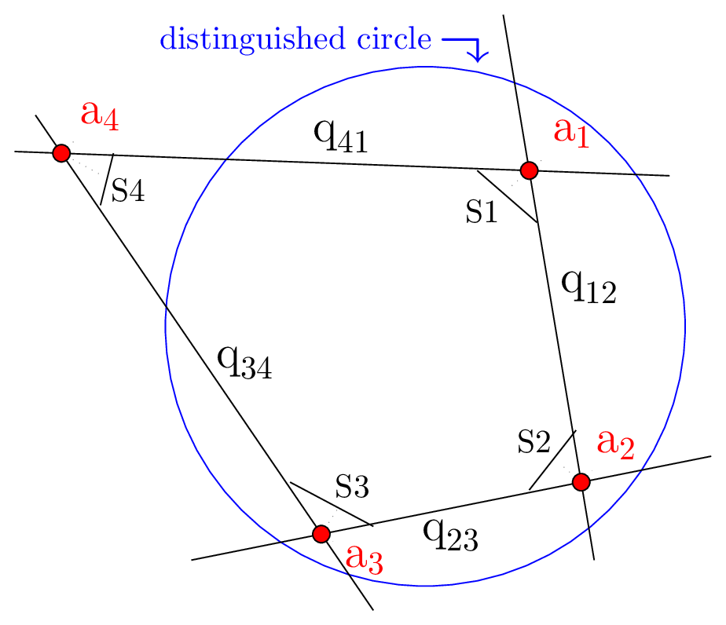

An h1 header
============

Never in all their history have men been able truly to conceive of the world as one: a single sphere, a globe, having the qualities of a globe, a round earth in which all the directions eventually meet, in which there is no center because every point, or none, is center — an equal earth which all men occupy as equals. The airman's earth, if free men make it, will be truly round: a globe in practice, not in theory.

Science cuts two ways, of course; its products can be used for both good and evil. But there's no turning back from science. The early warnings about technological dangers also come from science.

| Syntax      | Description |
| ----------- | ----------- |
| Header      | Title       |
| Paragraph   | Text        |

| Syntax      |   &nbsp; &nbsp; Description |
| :---------: | :------------: |
| :heavy_check_mark: | :x: |
| :x: | :heavy_check_mark: |
| :heavy_check_mark: | :x: |

@octocat :+1: This PR looks great - it's ready to merge! :shipit:

*[UHG]: Universal Hyperbolic Geometry

With UHG the math is exact.

What was most significant about the lunar voyage was not that man set foot on the Moon but that they set eye on the earth.

I give this plugin two :+1:!

Gone camping! :tent: Be back soon.

That is so funny! :joy:

| Function | &nbsp; &nbsp;  MySQL / MariaDB | &nbsp; &nbsp;  PostgreSQL | &nbsp; &nbsp; SQLite |
| :---- | :-----: | :--------: | :-------: |
|substr | :heavy_check_mark: |  :white_check_mark: | :heavy_check_mark: |


Paragraphs are separated by a blank line.

2nd paragraph. *Italic*, **bold**, and `monospace`. Itemized lists
look like:

  * this one
  * that one
  * the other one

Note that --- not considering the asterisk --- the actual text
content starts at 4-columns in.

> Block quotes are
> written like so.
>
> They can span multiple paragraphs,
> if you like.

Use 3 dashes for an em-dash. Use 2 dashes for ranges (ex., "it's all
in chapters 12--14"). Three dots ... will be converted to an ellipsis.
Unicode is supported. ☺


An h2 header
------------

Here's a numbered list:

 1. first item
 2. second item
 3. third item

Note again how the actual text starts at 4 columns in (4 characters
from the left side). Here's a code sample:

    # Let me re-iterate ...
    for i in 1 .. 10 { do-something(i) }

As you probably guessed, indented 4 spaces. By the way, instead of
indenting the block, you can use delimited blocks, if you like:

~~~
define foobar() {
    print "Welcome to flavor country!";
}
~~~

(which makes copying & pasting easier). You can optionally mark the
delimited block for Pandoc to syntax highlight it:

~~~python
import time
# Quick, count to ten!
for i in range(10):
    # (but not *too* quick)
    time.sleep(0.5)
    print i
~~~


### An h3 header ###

Now a nested list:

 1. First, get these ingredients:

      * carrots
      * celery
      * lentils

 2. Boil some water.

 3. Dump everything in the pot and follow
    this algorithm:

        find wooden spoon
        uncover pot
        do the other thing
        stir
        and stir some more
        cover pot
        balance wooden spoon precariously on pot handle
        wait 10 minutes
        goto first step (or shut off burner when done)

    Do not bump wooden spoon or it will fall.

Notice again how text always lines up on 4-space indents (including
that last line which continues item 3 above).

Here's a link to [a website](http://foo.bar), to a [local
doc](local-doc.html), and to a [section heading in the current
doc](#an-h2-header). Here's a footnote [^1].

[^1]: Footnote text goes here.

Tables can look like this:

|size | &nbsp; &nbsp; material   |  &nbsp; &nbsp;  color |
|--- |  ---------  | -------- |
|9   |  leather  |     brown |
|10 |   hemp canvas |  natural |
| 11 | glass | transparent |

Table: Shoes, their sizes, and what they're made of

(The above is the caption for the table.) Pandoc also supports
multi-line tables:

### multiline table using html `<br>`

|keyword  |&nbsp; &nbsp;  text |
|--------|  -----------------------|
|red     |  Sunsets, apples, and <br> other red or reddish <br>  things.  |
|green  |  Leaves, grass, frogs <br> and other things it's <br> not easy being.|

A horizontal rule follows using three stars

***

Another one using three dashes  

---

And another one using three underscores  

___


Here's a definition list:

Definition  
: Definition is a statement that describes the meaning of the listed word in the heading.   


apples  
: Good for making applesauce.  

oranges  
: Citrus!  

tomatoes  
: There's no "e" in tomatoe.

Again, text is indented 4 spaces. (Put a blank line between each
term/definition pair to spread things out more.)

Here's a "line block":

| Line one
|   Line too
| Line tree

and images can be specified like so:

##### Using full url


  

  
  
  
  
  

##### Using pathname


  

  
  
  
  
  

Inline math equations go in like so: $\omega = d\phi / dt$. Display
math should get its own line and be put in in double-dollarsigns:

$$I = \int \rho R^{2} dV$$

And note that you can backslash-escape any punctuation characters
which you wish to be displayed literally, ex.: \`foo\`, \*bar\*, etc.


<!-- Headings -->
# Heading 1
## Heading 2
### Heading 3
#### Heading 4
##### Heading 5
###### Headng 6

<!-- Emphasis -->
*This text* is italic  
_This text_ is italic

<!-- bold -->
**This text** is bold  
__This text__ is bold

<!-- bold and italicize text -->
##### bold and italicize text
***This is bold and italic***  

___This too is bold and italic___

<!-- strike through -->
~~This text~~ is strikethrough  

<!-- horizontal rule -->
---  
Horizontal rule to separate content
___  
Can also use 3 stars to add horizontal line

***


<!-- block quote -->
> Out of nothing I have created a strange new universe.
>
> -- <cite> Janos Bolyai </cite>

> Euclid freed of every flaw
>
> &mdash; <cite> Saccheri </cite>

##### BLock quote within a block quote
> This ia a block quote
> > This is sub block quote
> > > This is a sub sub block quote
> 
> very good


<!-- superscript -->
##### Superscript

X^2^  
X<sup>2</sup>


<!-- subscript -->
##### Subscript

H~2~O  
H<sub>2</sub>O


<!-- links -->
# Links

[Link text](https://www.google.com "google")  

<https://www.google.com>  

https://www.google.com

[Links header in page](#links)

### Reference links defined at bottom of page
[Universal Hyperbolic Geometry videos][uhg]  
[arXiv][uhgI]

### Turn and image into a link
[](https://www.markdownguide.org "Markdown Guide")  


##### Reference links
[uhg]: https://www.youtube.com/watch?v=EvP8VtyhzXs&list=PLIljB45xT85CN9oJ4gYkuSQQhAtpIucuI "Insights into Mathematics"  
[uhgI]: https://arxiv.org/abs/0909.1377 "Universal Hyperbolic Geometry I: Trigonometry"


<!-- Unordered list -->
##### Unordered List
* Item 1
* Item 2
* Item 3
    * Nested Item 1
    * Nested Item 2
* Item 4
    * Nested Item 4.1
        * Double nested item 4.1.1
* Item 5

##### You can use either symbol *, -, + for Unordered list
* Item 1
- Item 2
+ Item 3  

Another list
+ Item 1
+ Item 2
    - Item 1
    * Item 2
        * Item 1
        - Item 2
        + Item 3
* Item 3
- Item 4

<!-- Ordered list -->
##### Ordered List
1. Item 1
1. Item 2
1. Item 3
    1. Item 3.1
        1. Item 3.1.1
    1. Item 3.2
1. Item 4

<!-- Inline Code block -->
##### Inline Code Block (use back tick mark)
`<p>This is a paragraph</p>`

<!-- Images -->
##### Image


##### Relatve path
  

##### Using pathname
  


<!-- Github Markdown -->
#### Github Markdown

##### Code blocks (triple backticks ```code```)

```python
def hello():
    print("Hello World")
```

```javascript
function add(num1, num2){
    return num1 + num2
}
```

```mathematica
x = val
a b c
f[x,y]

```

##### Code blocks for jekyll kramdown (triple tilde ~~~code~~~)

~~~ python
def hello():
    print("Hello World")
~~~

~~~javascript
function add(num1, num2){
    return num1 + num2
}
~~~

~~~ javascript
function add(num1, num2){
    return num1 + num2
}
~~~

~~~ mathematica
x = val
a b c
f[x,y]

~~~

~~~mathematica
x = val
a b c
f[x,y]

~~~

~~~ ruby
def what?
  42
end
~~~

## Extended Markdown Functionality

##### Tables

|Name     | email |
|------   | ---- |
|John Doe | johndoe@gmail.com |
|Jane Doe | janedoe@gmail.com |

| Packages | Description | Version |
| :---     |    :---:    |    ---: |
| React    | Javascript Framework | v18.0 |
| Next.js  | React Framework      | v12.0 |


##### Task Lists

* [x] Task 1
* [x] Task 2
* [ ] Task 3

- [x] ldafdlkjf
- [ ] aldfsdlkf
- [X] lkdfadlfasdfj

#### Markdown Emoji 
##### Need Extension in vscode
:smile:  
:joy:  
:bulb:  


<script src="https://giscus.app/client.js"
        data-repo="jcoady/blog"
        data-repo-id="R_kgDOKZDDqA"
        data-category="blog comments"
        data-category-id="DIC_kwDOKZDDqM4CZzR4"
        data-mapping="pathname"
        data-strict="0"
        data-reactions-enabled="1"
        data-emit-metadata="0"
        data-input-position="top"
        data-theme="preferred_color_scheme"
        data-lang="en"
        data-loading="lazy"
        crossorigin="anonymous"
        async>
</script>


